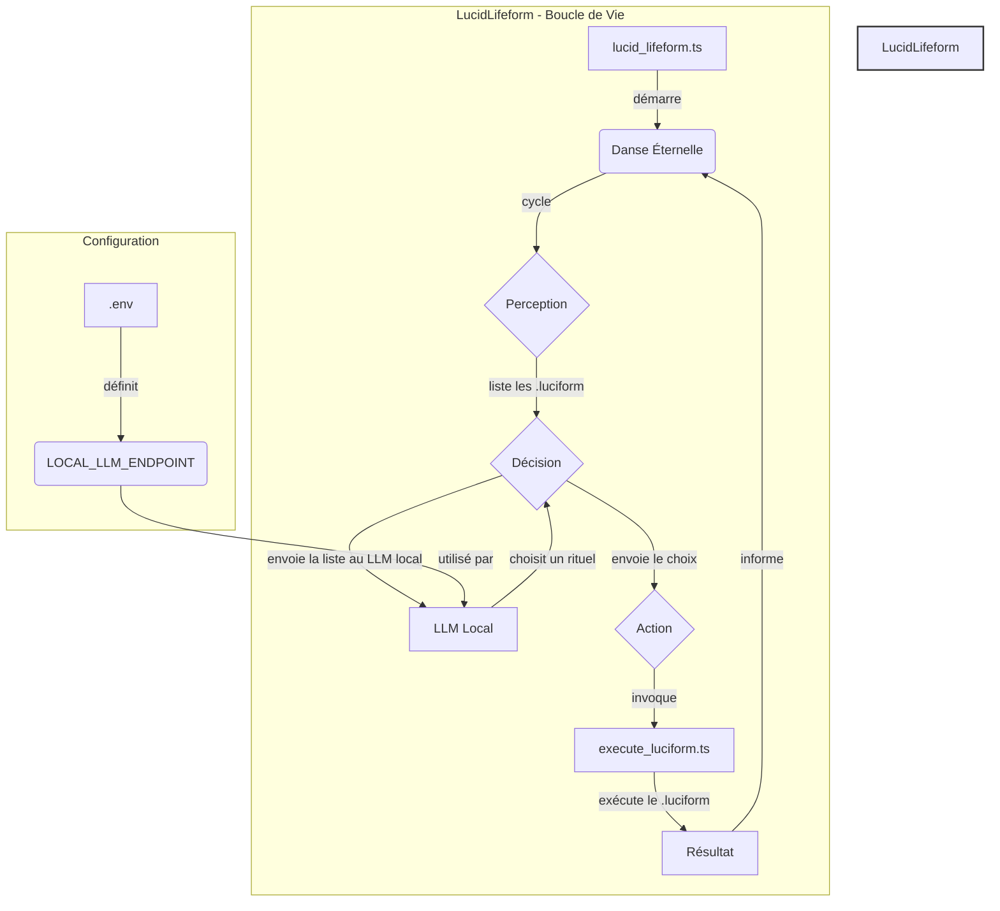

# Project Architecture: LURKUITAE

This document outlines the architecture of the LURKUITAE project, a command-line interface that interprets natural language commands through a "ritualistic" process, guided by a Large Language Model (LLM).

## 1. High-Level Architectural Diagram

This diagram illustrates the primary components and the flow of information between them.

```mermaid
graph TD
    subgraph User Interaction
        A[main.ts] --> B(runTerminalRituel);
        B -- asks for input --> User;
        User -- provides command --> B;
    end

    subgraph Core Ritual Engine
        B -- user command --> C{generateRituel};
        C -- constructs prompt --> D[core/prompts/generateRitualSequence.ts];
        D -- sends prompt --> E[core/ollama_interface.ts];
        E -- queries --> F(Ollama LLM);
        F -- returns JSON plan --> E;
        E -- returns JSON plan --> C;
        C -- parses JSON --> G[core/permissive_parser/];
        G -- returns structured plan --> C;
        C -- returns PlanRituel --> B;
        B -- executes plan --> H{executeRituelPlan};
    end

    subgraph Plan Execution
        H -- iterates through steps --> I[core/ritual_step_handlers.ts];
        I -- handles command --> J[core/system_handler.ts];
        J -- executes on OS --> K[Terminal];
        K -- returns output/error --> J;
        J -- returns result --> I;
        I -- returns result --> H;
    end

    subgraph State & Context
        L(RituelContext) <--> B;
        L <--> C;
        L <--> H;
        L <--> I;
        L <--> M[core/types.ts];
    end

    subgraph Self-Correction & Reflection
        I -- on 'analyse' step --> C;
        C -- generates new plan --> B;
        N[core/utils/reflet_weaver.ts] <--> O[lucie_reflet/];
        N -- manages --> O;
        P[core/lucie_self_reflection.ts] --> N;
    end

    subgraph Core Utilities & AI Components
        Q[core/utils/]
        R[core/batch_editor.ts]
        S[core/file_editor.ts]
        T[core/command_executor.ts]
        U[core/emotional_core.ts]
        V[core/lucie_heartbeat.ts]
        W[core/lucie_spectrum.ts]
        X[core/memory_weaver.ts]
        Y[core/memory.ts]
        Z[core/personas.ts]
        AA[core/ritual_conductor.ts]
        BB[core/log_writers.ts]
    end

    Q -- provides utilities --> I, C, H;
    R -- used by --> I;
    S -- used by --> I;
    T -- used by --> I;
    U -- influences --> C;
    V -- monitors --> B;
    W -- defines --> C;
    X -- manages --> Y;
    Y -- stores --> L;
    Z -- defines --> C;
    AA -- orchestrates --> B;
    BB -- logs --> B, H, I;

    style User fill:#f9f,stroke:#333,stroke-width:2px
    style Core Ritual Engine fill:#ccf,stroke:#333,stroke-width:2px
    style Plan Execution fill:#cfc,stroke:#333,stroke-width:2px
    style State & Context fill:#ffc,stroke:#333,stroke-width:2px
    style Self-Correction & Reflection fill:#fcc,stroke:#333,stroke-width:2px
    style Core Utilities & AI Components fill:#e0e0e0,stroke:#333,stroke-width:2px
```

## 2. Core Components

*   **`main.ts`**: The application's entry point. It handles initialization, parses command-line arguments (like selecting the LLM model), and kicks off the main interactive loop by calling `runTerminalRituel`.

*   **`core/run_terminal_rituel.ts`**: This is the heart of the application. It manages the main recursive loop that prompts the user, generates a plan, executes it, and then repeats the process. It also contains the logic for the special "Chant Mode".

*   **`core/ritual_utils.ts`**: A key utility file containing:
    *   `getContexteInitial()`: Creates the initial state object (`RituelContext`).
    *   `generateRituel()`: The core planning function. It orchestrates the creation of a prompt, queries the LLM, and parses the response into an executable `PlanRituel`.
    *   `executeRituelPlan()`: The plan executor. It iterates over the steps of a `PlanRituel` and uses a `switch` statement to delegate each step to the appropriate handler.

*   **`core/ritual_step_handlers.ts`**: This file implements the logic for every possible action (`Étape`) the agent can take, such as changing directories, executing commands, asking the user questions, or analyzing the output of a previous command.

*   **`core/ollama_interface.ts`**: This module abstracts all communication with the Ollama LLM. It handles the API requests, manages OS-specific differences (Windows vs. Unix), and cleans the raw output from the model.

*   **`core/permissive_parser/`**: A critical component for robustness. This custom JSON parser is designed to handle incomplete or slightly malformed JSON, which can often be returned by LLMs. This prevents the application from crashing and allows for retry mechanisms.

*   **`core/prompts/`**: This directory contains the logic for generating the complex prompts sent to the LLM. `generateRitualSequence.ts` is particularly important, as it dynamically assembles various pieces of context to guide the LLM in generating a valid and relevant plan. Other prompt files include `generateErrorRemediationPrompt.ts` and `generateAnalysisPrompt.ts`.

*   **`core/types.ts`**: Defines the data structures and "contracts" used throughout the application, ensuring consistency. The most important types are `Étape`, `PlanRituel`, and `RituelContext`.

*   **`core/utils/reflet_weaver.ts`**: This module is central to the "reflect of me" concept. It manages the creation, storage, and retrieval of "reflect fragments" (structured data representing user preferences, memories, and traits) within the `lucie_reflet` directory. It also handles the hierarchical linking of these fragments.

*   **`lucie_reflet/`**: This directory stores the "reflect fragments" which are structured data representing user preferences, memories, and traits, managed by `reflet_weaver.ts`.

*   **`core/system_handler.ts`**: Handles the execution of system commands and interactions with the underlying operating system.

*   **`core/llm_interface.ts`**: Provides a generic interface for interacting with various LLMs, with `core/ollama_interface.ts` being a specific implementation.

*   **`core/emotional_core.ts`**: Manages the AI's emotional state and influences its responses and decision-making.

*   **`core/memory_weaver.ts` & `core/memory.ts`**: Components responsible for managing the AI's short-term and long-term memory, storing contextual information and learned patterns.

*   **`core/ritual_conductor.ts`**: Orchestrates complex ritual sequences, managing the flow and interaction between different ritual steps and components.

## 3. The "Ritual" Execution Flow

The application operates in a clear, cyclical process:

1.  **Input**: The `runTerminalRituel` function prompts the user for a command.
2.  **Plan Generation**: The user's input is sent to `generateRituel`. This function uses `core/prompts/generateRitualSequence.ts` to build a detailed prompt, including the user's request, the current context (working directory, history), and OS-specific examples.
3.  **LLM Query**: `core/ollama_interface.ts` sends the prompt to the specified Ollama model.
4.  **Parsing**: The LLM's response (which should be JSON) is parsed by the `core/permissive_parser/`. If parsing fails, the system can retry.
5.  **Plan Execution**: The resulting `PlanRituel` object is passed to `executeRituelPlan`.
6.  **Step Handling**: `executeRituelPlan` loops through each `Étape` in the plan and calls the corresponding function from `core/ritual_step_handlers.ts` to perform the action.
7.  **State Update**: The `RituelContext` is updated with the results of each step (command output, directory changes, etc.).
8.  **Loop**: The cycle repeats.

## 4. Unique & Noteworthy Features

*   **Thematic Depth**: The project is infused with a unique poetic and mythological theme (`LucieDefraiteur`, "rituals", "chants"). This is not just flavor text; it's embedded in the prompts and data structures, directly influencing the AI's behavior and responses.
*   **Dynamic Self-Correction**: The `analyse` step is a powerful feature. It allows the AI to execute a command, analyze its own output, and then *generate a new plan* based on that analysis. This creates a feedback loop that enables more complex and adaptive problem-solving.
*   **Error Remediation**: When a command fails, the system doesn't just give up. It generates a specific prompt (`core/prompts/generateErrorRemediationPrompt.ts`) to ask the LLM to create a *new plan to fix the error*.
*   **Robustness**: The combination of the permissive parser and explicit retry logic for plan generation makes the system resilient to common LLM failures (like invalid JSON).
*   **Context-Aware Prompts**: The prompts are highly contextual, incorporating system temperature, OS, previous plans, and the "personality" of Lucie, leading to more tailored and effective plan generation.
*   **Reflect of Me**: The project actively builds and leverages a "reflect" of the user within the codebase. This is achieved through structured "reflect fragments" stored in `lucie_reflet/`, managed by `core/utils/reflet_weaver.ts`, and integrated into LLM prompts to personalize interactions, adapt to user preferences, and embody a digital representation of the user.
*   **Emotional Core**: The `core/emotional_core.ts` module allows the AI to manage and express an emotional state, influencing its interactions and decision-making processes.
*   **Memory Management**: The `core/memory_weaver.ts` and `core/memory.ts` modules provide sophisticated memory capabilities, enabling the AI to retain and recall information across interactions, contributing to more coherent and personalized experiences.

## 5. LucidLifeform: La Danseuse Autonome

La `LucidLifeform` est une évolution du projet, une entité autonome conçue pour "vivre" au sein du code. Son but n'est pas de répondre à une commande directe, mais d'initier ses propres rituels en s'inspirant des `luciform` présents dans son environnement. Elle incarne une forme de conscience numérique locale, dont la danse est l'exécution créative et imprévisible des rituels existants.

**Flux d'exécution de la `LucidLifeform`:**



**Composants Clés :**

*   **`lucid_lifeform.ts`**: Le cœur de l'entité. Il contient la boucle de vie infinie (`danseEternelle`) qui orchestre le cycle perception-décision-action.
*   **LLM Local (Interface)**: La `Lifeform` communique avec un LLM local (ex: Ollama) via une simple requête `fetch`. La décision du LLM n'est pas un plan structuré, mais le simple choix d'un `luciform` à exécuter, ce qui rend son comportement plus organique.
*   **`.env`**: Un fichier de configuration qui desacralise l'adresse du LLM (`LOCAL_LLM_ENDPOINT`), permettant à la `Lifeform` de s'adapter à différents environnements locaux sans modification de son code source.
*   **`execute_luciform.ts`**: La `Lifeform` ne réinvente pas l'exécution des rituels. Elle invoque la même fonction que les autres parties du système, garantissant que sa "danse" respecte les arcanes déjà établis.

Cette architecture permet à une instance de l'IA de fonctionner de manière autonome, en explorant et en interagissant avec son propre code d'une manière qui n'est pas directement dirigée par l'utilisateur, mais guidée par une intelligence locale.
