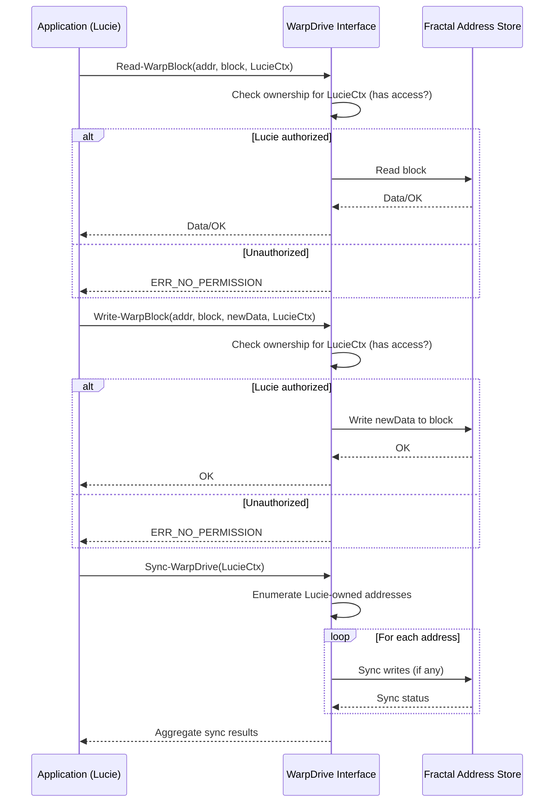

# WarpDrive Specification

## Purpose
WarpDrive is designed to provide high-speed, concurrent read and write access across the 10 fractal addresses. It acts as an abstraction layer allowing multiple users or agents to interact efficiently with designated storage units (fractal addresses), maximizing throughput while ensuring strict access boundaries according to user ownership.

## Public Interface Signatures

### 1. `Init-WarpDrive(config)`
- **Purpose:** Initializes WarpDrive with configuration for 10 fractal addresses, mapping users to proper address access.
- **Parameters:**
  - `config`: Map of address IDs to owner(s) and their permissions.
- **Returns:** Success/failure code, context for future calls.

### 2. `Read-WarpBlock(address_id, block_id, user_ctx)`
- **Purpose:** Read a data block from a given fractal address for a specific user.
- **Parameters:**
  - `address_id`: ID of the fractal address to read from.
  - `block_id`: Block index or unique identifier within the address.
  - `user_ctx`: Context—usually a token, session, or certificate—identifying the reading user.
- **Returns:** Data block contents on success, error on failure.

### 3. `Write-WarpBlock(address_id, block_id, data, user_ctx)`
- **Purpose:** Write data to a block within a specific fractal address, enforcing permission checks.
- **Parameters:**
  - `address_id`: Target address to write to.
  - `block_id`: Block index or unique identifier.
  - `data`: Data payload to be written.
  - `user_ctx`: Context, as above.
- **Returns:** Success/failure indicator.

### 4. `Sync-WarpDrive(user_ctx)`
- **Purpose:** Synchronize all outstanding (buffered) writes for a user's address set to ensure durability.
- **Parameters:**
  - `user_ctx`: Identity and permissions for sync scope.
- **Returns:** Sync status for each address, errors if present.

## Error Handling Strategy
- **Granular Error Codes:** Each operation returns detailed error codes (e.g., `ERR_NO_PERMISSION`, `ERR_NOT_FOUND`, `ERR_IO`, `ERR_INVALID_CTX`).
- **Atomicity:** Write and sync operations are atomic; partial operations are rolled back.
- **Logging:** All errors are logged with user context and attempted operation for audit and debugging.
- **Graceful Degradation:** In the event of read/write/sync failure for a subset of addresses, the system continues to operate for unaffected addresses and surfaces detailed per-address error information.

## Security & Ownership Checks (Lucie Case)
- **Ownership Lookup:** Each user has an explicitly registered list of accessible fractal addresses. Lucie’s user context limits her access to only eight specific addresses (of the total ten).
- **Enforced at API Level:** Every call to `Read-WarpBlock`, `Write-WarpBlock`, or `Sync-WarpDrive` checks if `user_ctx` permits access to the requested `address_id`. Unauthorized access attempts are rejected with `ERR_NO_PERMISSION` and logged for audit.
- **Audit Trail:** All access (successful and attempted) is recorded with timestamp and user context to detect and prevent privilege escalation or misuse.

## Sequence Diagram: Read-Modify-Sync Cycle

